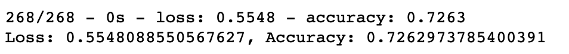

# Neural Network Charity Analysis
The goal of this project was to identify non-profit organizations that would use their money successfully, if Alphabet Soup invested in their cause.  A neural network model was created to predict the success of each investment opportunity.  A targeted prediction accuracy rate of 75% was the objective.  However, the maximum rate achieved was 72.7%.

## Results
### Data Preprocessing
* What variable(s) are considered the target(s) for your model? "IS_SUCCESSFUL" is the target
* What variable(s) are considered to be the features for your model? There final list of features included in the model were:
- 'APPLICATION_TYPE'
- 'AFFILIATION'
- 'CLASSIFICATION'
- 'USE_CASE'
- 'ORGANIZATION'
- 'STATUS'
- 'INCOME_AMT'
- 'SPECIAL_CONSIDERATIONS'
- 'ASK_AMT'
* What variable(s) are neither targets nor features, and should be removed from the input data? Variables removed included 'EIN', 'NAME', and duplicative fields after encoding (i.e. 'SPECIAL_CONSIDERATIONS_N')
### Compiling, Training, and Evaluating the Model
* How many neurons, layers, and activation functions did you select for your neural network model, and why? The final model included 3 hidden layers (added one on top of the initial model), with 50 neurons for each layer (5 times the size of the initial model), and used the tanh activation function (instead of the initial sigmoid function).  There were three attempts made with different changes for each round:
1) The first optimization doubled the number of neurons from 10 to 20, and also added a hidden layer with 20 neurons.
2) The second optimization binned the INCOME_AMT field to create an OTHER bucket, and removed a duplicative field ('SPECIAL_CONSIDERATIONS_N').
3) The third optimization changed the activation layer to a tanh function instead of sigmoid, with the number of neurons for each hidden layer bumped up to 50 (instead of 20)
* Were you able to achieve the target model performance?
No.  Unfortunately, there was a slight deprecation in model accuracy with each attempted optimization.  The results for each round were as follows
#### Optimzation 1

#### Optimization 2

#### Optimization 3

* What steps did you take to try and increase model performance?
There were a number of tactics attempted to try to boost performance:
- Increasing number of hidden layers and neurons
- Removing fields that could be driving noise within the data
- Changing the activiation function on the output layer

## Conclusion
In order to get to a targeted level of 75% accuracy, a different model would need to be pursued to investigate if it's even possible to achieve a 75% accuracy in predictions with this data set.  